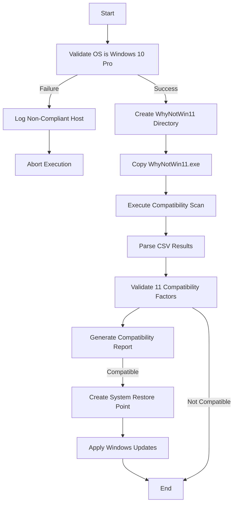

## Overview

The **fase_1** role performs comprehensive pre-upgrade validation and preparation for Windows 10 to Windows 11 migration. This phase ensures that target systems meet all hardware and software requirements before attempting the upgrade process.

### Key Responsibilities

- Validates the operating system is Windows 10 Pro
- Checks hardware compatibility using WhyNotWin11 tool
- Generates detailed compatibility reports
- Creates system restore points
- Applies pending Windows updates

---

## Tasks Performed

### 1. OS Validation

The role begins by validating that the target system is running Windows 10 Pro.

```yaml
- name: 1.1 Validacion de Sistema Operativo
  ansible.builtin.assert:
    that:
      - ansible_distribution == "Microsoft Windows 10 Pro"
    success_msg: "El Sistema Operativo SI es Windows 10 Pro"
    fail_msg: "El Sistema Operativo NO es Windows 10 Pro"
  register: so_out
```

**Error Handling**: If validation fails, the system is logged to `not_compliant_hosts.log` and task execution is halted.

---

### 2. Hardware Compatibility Check

The role uses the **WhyNotWin11** tool to perform a comprehensive hardware compatibility assessment.

#### 2.1 Setup WhyNotWin11

```yaml
- name: 2.1 Crear Directorio de 'WhyNotWin11' (si no existe)
  ansible.windows.win_file:
    path: "{{ fase_1_dir_whynotwin11 }}"
    state: directory

- name: 2.3 Copiar 'WhyNotWin11' a Directorio
  ansible.windows.win_copy:
    src: roles/fase_1/files/WhyNotWin11.exe
    dest: "{{ fase_1_dir_whynotwin11 }}/WhyNotWin11.exe"
    remote_src: false
  when: why_dir_out.stat.exists
```

#### 2.2 Execute Compatibility Scan

```yaml
- name: 2.7 Ejecutar 'WhyNotWin11' (silencioso) y Generar Archivo CSV
  ansible.windows.win_shell: |
    {{ fase_1_dir_whynotwin11 }}/WhyNotWin11.exe /e CSV {{ fase_1_dir_whynotwin11 }}/Salida_Compatibilidad.csv /s
  args:
    executable: powershell.exe
  register: whynotwin11_output
  when: whynoywin11_stat.stat.exists
```

#### 2.3 Parse Compatibility Results

The role parses the CSV output and extracts 11 key compatibility factors:

```yaml
- name: 2.9 Analizar la Compatibilidad del PC
  ansible.builtin.set_fact:
    architecture: "{{ csv_content.stdout_lines[1].split(',')[1] }}"
    boot_method: "{{ csv_content.stdout_lines[1].split(',')[2] }}"
    cpu_compatibility: "{{ csv_content.stdout_lines[1].split(',')[3] }}"
    cpu_core_count: "{{ csv_content.stdout_lines[1].split(',')[4] }}"
    cpu_frequency: "{{ csv_content.stdout_lines[1].split(',')[5] }}"
    directx_wddm2: "{{ csv_content.stdout_lines[1].split(',')[6] }}"
    disk_partition_type: "{{ csv_content.stdout_lines[1].split(',')[7] }}"
    ram_installed: "{{ csv_content.stdout_lines[1].split(',')[8] }}"
    secure_boot: "{{ csv_content.stdout_lines[1].split(',')[9] }}"
    storage_available: "{{ csv_content.stdout_lines[1].split(',')[10] }}"
    tpm_version: "{{ csv_content.stdout_lines[1].split(',')[11] }}"
  when: csv_content.stdout_lines | length > 1
```

#### 2.4 Compatibility Requirements

Each factor must be "True" for the system to be compatible:

| Factor | Requirement |
|--------|-------------|
| **Architecture** | 64 Bit CPU, 64 Bit OS |
| **Boot Method** | UEFI |
| **CPU Compatibility** | Intel Core (i3, i5, i7, i9) 8th Gen or AMD Ryzen (3, 5, 7, 9, Threadripper) 2000+ |
| **CPU Core Count** | 2 or more cores |
| **CPU Frequency** | 1 GHz or higher |
| **DirectX + WDDM2** | DirectX 12 or higher & WDDM2 2.x |
| **Disk Partition** | GPT partition style |
| **RAM Installed** | 4 GB or more |
| **Secure Boot** | Enabled |
| **Storage Available** | 64 GB or more on C: drive |
| **TPM Version** | TPM 2.0 (Enabled) |

---

### 3. Compatibility Report Generation

A detailed text report is generated for each system:

```yaml
- name: 2.14 Generar reporte de compatibilidad
  ansible.builtin.copy:
    content: |
      Reporte de Compatibilidad para: {{ ansible_fqdn }}
      -----------------------------------------------
      - Architecture: {{ architecture }}
      - Boot Method: {{ boot_method }}
      - CPU Compatibility: {{ cpu_compatibility }}
      - CPU Core Count: {{ cpu_core_count }}
      - CPU Frequency: {{ cpu_frequency }}
      - DirectX + WDDM2: {{ directx_wddm2 }}
      - Disk Partition: {{ disk_partition_type }}
      - Ram Installed: {{ ram_installed }}
      - Secure Boot: {{ secure_boot }}
      - Storage Available: {{ storage_available }}
      - TPM Version: {{ tpm_version }}
    dest: roles/fase_1/files/{{ ansible_fqdn }}-compatibility_report.txt
    mode: "0644"
```

**Output Location**: `roles/fase_1/files/<hostname>-compatibility_report.txt`

---

### 4. System Restore Point Creation

For compatible systems, a restore point is created as a safety measure:

```yaml
- name: 3.1 Comprobar el estado de Proteccion del Sistema
  ansible.windows.win_shell: |
    (Get-ComputerRestorePoint).SequenceNumber
  args:
    executable: powershell.exe
  changed_when: false
  register: restore_points

- name: 3.2 Activar la Proteccion del Sistema (si no esta activo)
  ansible.windows.win_shell: |
    Enable-ComputerRestore -Drive C:
  when: restore_points.stdout == ""
  register: activate_out

- name: 3.3 Crear Punto de Restauracion
  ansible.windows.win_shell: |
    Checkpoint-Computer -Description "Pre-Windows11-Migration" -RestorePointType "MODIFY_SETTINGS"
  args:
    executable: powershell.exe
  register: create_point
```

**Restore Point Name**: `Pre-Windows11-Migration`

---

### 5. Windows Update Application

The role ensures all pending Windows updates are applied before migration:

```yaml
- name: 4.1 Validar si hay reinicios pendientes (reiniciar en caso +)
  ansible.windows.win_reboot:
  when: ansible_reboot_pending

- name: 4.2 Aplicar parches de ser Necesario
  ansible.windows.win_updates:
    category_names: "*"
    reboot: true
  register: update_results
  retries: 3
  delay: 120
  until: update_results.failed_update_count == 0
```

**Retry Logic**: The update process retries up to 3 times with a 120-second delay between attempts.

---

## Variables

Defined in `defaults/main.yml`:

```yaml
fase_1_dir_whynotwin11: C:\temp\ansible
```

| Variable | Default Value | Description |
|----------|---------------|-------------|
| `fase_1_dir_whynotwin11` | `C:\temp\ansible` | Working directory for WhyNotWin11 tool and temporary files |

---

## Files Included

### WhyNotWin11.exe

**Location**: `roles/fase_1/files/WhyNotWin11.exe`

**Purpose**: Third-party compatibility checker tool that validates Windows 11 hardware requirements.

**Size**: ~2.5 MB

**Usage**: Automatically executed in silent mode to generate CSV compatibility reports.

---

## Output Artifacts

### Compatibility Reports

**Format**: Plain text (.txt)

**Location**: `roles/fase_1/files/<hostname>-compatibility_report.txt`

**Example Output**:

```
Reporte de Compatibilidad para: DESKTOP-Q0VHFVT
-----------------------------------------------
- Architecture: True
- Boot Method: True
- CPU Compatibility: True
- CPU Core Count: True
- CPU Frequency: True
- DirectX + WDDM2: True
- Disk Partition: True
- Ram Installed: True
- Secure Boot: True
- Storage Available: True
- TPM Version: True
```

### Non-Compliant Hosts Log

**Location**: `roles/fase_1/files/not_compliant_hosts.log`

**Purpose**: Tracks systems that fail OS validation.

---

## Execution Flow



---

## Prerequisites

- Target system must be running Windows 10 Pro
- WinRM must be configured and accessible
- System Restore must be available on C: drive
- Administrator privileges required
- Network connectivity for Windows Update

---

## Error Handling

The role implements comprehensive error handling:

- **OS Validation Failure**: System logged and execution halted
- **WhyNotWin11 Execution Failure**: Error logged, cleanup of temporary CSV files
- **Update Failures**: Automatic retry with exponential backoff (3 attempts)

---

## See Also

- [Phase 2: Upgrade Role](/reference/roles/fase-2) - Performs the actual Windows 11 upgrade
- [Execution Guide](/guide/execution) - How to run the migration playbook
- [Configuration](/reference/variables) - Customizing role variables