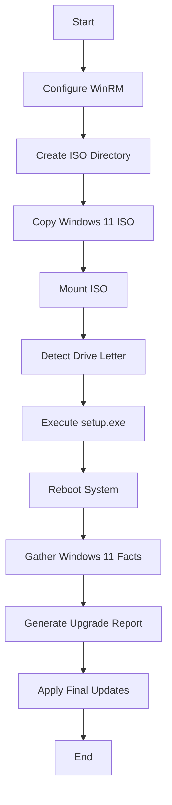
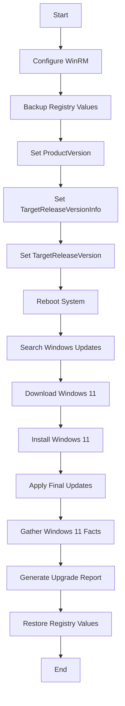

## Overview

The **fase_2** role performs the actual Windows 11 upgrade on validated systems. It supports two distinct upgrade methods:

1. **ISO-based Upgrade**: Mounts a Windows 11 ISO and runs setup.exe with automated parameters
2. **Registry-based Upgrade**: Modifies Windows Update registry keys to trigger Windows 11 upgrade via Windows Update

Both methods include WinRM configuration setup, post-upgrade validation, and comprehensive reporting.

---

## Upgrade Methods

<Tabs>
  <Tab title="ISO-based Upgrade">
    
### ISO-based Upgrade Process

This method uses a pre-downloaded Windows 11 ISO file to perform an in-place upgrade.

#### 1. WinRM Configuration

```yaml
- name: 1.1 Crear directorio PS
  ansible.windows.win_file:
    path: "{{ fase_2_dir_whynotwin11 }}/PS"
    state: directory

- name: 1.3 Copiar PS a Directorio
  ansible.windows.win_copy:
    src: roles/fase_2/files/WinRM.ps1
    dest: "{{ fase_2_dir_whynotwin11 }}/PS/WinRM.ps1"
    remote_src: false
  when: ps_dir_out.stat.exists
```

**Source**: `roles/fase_2/tasks/main.yml:3-20`

---

#### 2. ISO Preparation

The Windows 11 ISO is copied to the target system and mounted:

```yaml
- name: 2.1 Crear directorio ISO
  ansible.windows.win_file:
    path: "{{ fase_2_dir_whynotwin11 }}/ISO"
    state: directory

- name: 2.3 Copiar ISO a Directorio
  ansible.windows.win_copy:
    src: roles/fase_2/files/Win11_23H2_Spanish_Mexico_x64v2.iso
    dest: "{{ fase_2_dir_whynotwin11 }}/ISO/Win11_23H2_Spanish_Mexico_x64v2.iso"
    remote_src: false
  when: iso_dir_out.stat.exists

- name: 2.4 Montar ISO Windows 11 en {{ ansible_fqdn }}
  ansible.windows.win_shell: |
    Mount-DiskImage -ImagePath "{{ fase_2_dir_whynotwin11 }}/ISO/Win11_23H2_Spanish_Mexico_x64v2.iso"
  when: iso_dir_out.stat.exists
```

**Source**: `roles/fase_2/tasks/main.yml:29-55`

---

#### 3. Detect Mounted Drive

```yaml
- name: 2.5 Obtener la letra de la unidad donde se montó la ISO
  ansible.windows.win_shell: |
    Get-Volume -FileSystemLabel "CCCOMA_X64FRE_ES-MX_DV9" | Select-Object -ExpandProperty DriveLetter
  register: iso_mount
  args:
    executable: powershell.exe
```

**ISO Label**: `CCCOMA_X64FRE_ES-MX_DV9` (Windows 11 23H2 Spanish Mexico)

**Source**: `roles/fase_2/tasks/main.yml:57-62`

---

#### 4. Execute Upgrade

The Windows 11 setup is launched with automated parameters:

```yaml
- name: 3.1 Ejecutar el instalador de Windows 11 desde la ISO montada
  ansible.windows.win_shell: >
    Start-Process -FilePath "{{ iso_mount.stdout | trim }}:\setup.exe" -ArgumentList
    '/auto upgrade', '/quiet', '/eula accept', '/showoobe none', '/priority normal', '/noreboot',
    '/compat ignorewarning', '/migratedrivers all', '/copylogs C:\temp\ansible' -Wait
  args:
    executable: powershell.exe
  register: upd_w11
```

**Setup Arguments**:
- `/auto upgrade` - Automated upgrade mode
- `/quiet` - Silent installation
- `/eula accept` - Accept license agreement
- `/showoobe none` - Skip OOBE (Out-of-Box Experience)
- `/priority normal` - Normal process priority
- `/noreboot` - Don't reboot automatically
- `/compat ignorewarning` - Ignore compatibility warnings
- `/migratedrivers all` - Migrate all drivers
- `/copylogs C:\temp\ansible` - Copy installation logs

**Source**: `roles/fase_2/tasks/main.yml:70-77`

---

#### 5. System Reboot

```yaml
- name: 3.2 Reiniciar el servidor para completar la instalación de Windows 11
  ansible.windows.win_reboot:
    msg: "El servidor se reiniciará para completar la instalación de Windows 11"
    reboot_timeout: 3600  # 1 hour timeout for prolonged reboots
  when: upd_w11.rc == 0

- name: 3.3 Realizar una Pausa
  ansible.builtin.pause:
    seconds: 30

- name: 3.4 Reiniciar PC
  ansible.windows.win_reboot:
```

**Timeout**: 3600 seconds (1 hour) to accommodate extended upgrade process

**Source**: `roles/fase_2/tasks/main.yml:79-90`

  </Tab>
  
  <Tab title="Registry-based Upgrade">
    
### Registry-based Upgrade Process

This method modifies Windows Update registry keys to trigger a Windows 11 feature update.

#### 1. WinRM Configuration

Identical to the ISO-based method:

```yaml
- name: 1.1 Crear directorio PS
  ansible.windows.win_file:
    path: "{{ fase_2_dir_whynotwin11 }}/PS"
    state: directory

- name: 1.3 Copiar PS a Directorio
  ansible.windows.win_copy:
    src: roles/fase_2/files/WinRM.ps1
    dest: "{{ fase_2_dir_whynotwin11 }}/PS/WinRM.ps1"
    remote_src: false
```

**Source**: `roles/fase_2/tasks/regedit_main.yml:3-20`

---

#### 2. Backup Existing Registry Values

Before modification, existing registry values are backed up:

```yaml
- name: 2.1 Guardar estado actual de TargetReleaseVersion
  ansible.windows.win_shell: |
    $key = 'HKLM:\SOFTWARE\Policies\Microsoft\Windows\WindowsUpdate'
    $name = 'TargetReleaseVersion'
    if (Test-Path "$key\$name") {
      Get-ItemProperty -Path $key -Name $name | Select-Object -ExpandProperty $name
    }
  register: target_release_version

- name: 2.2 Guardar estado actual de TargetReleaseVersionInfo
  ansible.windows.win_shell: |
    $key = 'HKLM:\SOFTWARE\Policies\Microsoft\Windows\WindowsUpdate'
    $name = 'TargetReleaseVersionInfo'
    if (Test-Path "$key\$name") {
      Get-ItemProperty -Path $key -Name $name | Select-Object -ExpandProperty $name
    }
  register: target_release_version_info

- name: 2.3 Verificar si la clave ProductVersion existe
  ansible.windows.win_shell: |
    $key = 'HKLM:\SOFTWARE\Policies\Microsoft\Windows\WindowsUpdate'
    $name = 'ProductVersion'
    if (Test-Path "$key\$name") {
      Get-ItemProperty -Path $key -Name $name | Select-Object -ExpandProperty $name
    }
  register: product_version
```

**Registry Path**: `HKLM:\SOFTWARE\Policies\Microsoft\Windows\WindowsUpdate`

**Source**: `roles/fase_2/tasks/regedit_main.yml:24-49`

---

#### 3. Configure Registry for Windows 11

Three registry keys are set to target Windows 11 23H2:

```yaml
- name: 2.4 Configurar TargetProductVersion
  ansible.windows.win_regedit:
    path: HKLM:\SOFTWARE\Policies\Microsoft\Windows\WindowsUpdate
    name: ProductVersion
    data: "Windows 11"
    type: string

- name: 2.5 Configurar clave TargetReleaseVersionInfo para la versión de destino
  ansible.windows.win_regedit:
    path: HKLM:\SOFTWARE\Policies\Microsoft\Windows\WindowsUpdate
    name: TargetReleaseVersionInfo
    data: "23H2"
    type: string

- name: 2.6 Configurar clave TargetReleaseVersion para forzar la actualización a Windows 11
  ansible.windows.win_regedit:
    path: HKLM:\SOFTWARE\Policies\Microsoft\Windows\WindowsUpdate
    name: TargetReleaseVersion
    data: 1
    type: dword
```

**Registry Keys**:
- `ProductVersion` (String): "Windows 11"
- `TargetReleaseVersionInfo` (String): "23H2"
- `TargetReleaseVersion` (DWORD): 1

**Source**: `roles/fase_2/tasks/regedit_main.yml:51-70`

---

#### 4. Initial Reboot

```yaml
- name: 2.7 Reiniciar el servidor
  ansible.windows.win_reboot:
    msg: "Reiniciando el servidor para aplicar cambios de registro"
    reboot_timeout: 600
```

**Source**: `roles/fase_2/tasks/regedit_main.yml:72-75`

---

#### 5. Windows Update Process

The upgrade is triggered through Windows Update:

```yaml
- name: 3.2 Buscar actualizaciones manualmente
  ansible.windows.win_updates:
    category_names: "*"
    state: searched
  register: search_results

- name: 3.3 Descargar actualizaciones
  ansible.windows.win_updates:
    category_names: "*"
    state: downloaded
  register: download_results
  when: search_results.updates | length > 0

- name: 3.4 Instalar actualizaciones
  ansible.windows.win_updates:
    category_names: "*"
    state: installed
  register: install_results
  when: download_results.updates | length > 0
```

**Process**: Search → Download → Install

**Source**: `roles/fase_2/tasks/regedit_main.yml:85-103`

---

#### 6. Complete Installation

```yaml
- name: 3.4 Instalar todas las actualizaciones pendientes en Windows 11
  ansible.windows.win_updates:
    category_names: "*"
    reboot: true
  register: update11_results_all
  retries: 3
  delay: 120
  until: update11_results_all.failed_update_count == 0

- name: 3.5 Reiniciar el servidor para completar la instalación de Windows 11
  ansible.windows.win_reboot:
    msg: "El servidor se reiniciará para completar la instalación de Windows 11"
```

**Retry Logic**: Up to 3 attempts with 120-second delay

**Source**: `roles/fase_2/tasks/regedit_main.yml:115-126`

---

#### 7. Restore Registry Keys

After successful upgrade, original registry values are restored:

```yaml
- name: 4.1 Restaurar el valor original de ProductVersion
  ansible.windows.win_regedit:
    path: HKLM:\SOFTWARE\Policies\Microsoft\Windows\WindowsUpdate
    name: ProductVersion
    data: "{{ product_version.stdout }}"
    type: string
  when: product_version.stdout is defined

- name: 4.2 Restaurar el valor original de TargetReleaseVersionInfo
  ansible.windows.win_regedit:
    path: HKLM:\SOFTWARE\Policies\Microsoft\Windows\WindowsUpdate
    name: TargetReleaseVersionInfo
    data: "{{ target_release_version_info.stdout }}"
    type: string
  when: target_release_version_info.stdout is defined

- name: 4.3 Restaurar el valor original de TargetReleaseVersion
  ansible.windows.win_regedit:
    path: HKLM:\SOFTWARE\Policies\Microsoft\Windows\WindowsUpdate
    name: TargetReleaseVersion
    data: "{{ target_release_version.stdout }}"
    type: dword
  when: target_release_version.stdout is defined

- name: 4.4 Eliminar la clave WindowsUpdate si no existía antes
  ansible.windows.win_regedit:
    path: HKLM:\SOFTWARE\Policies\Microsoft\Windows\WindowsUpdate
    state: absent
  when: product_version.stdout is not defined and target_release_version_info.stdout is not defined and target_release_version.stdout is not defined
```

**Source**: `roles/fase_2/tasks/regedit_main.yml:149-179`

  </Tab>
</Tabs>

---

## Post-Upgrade Validation

Both upgrade methods perform identical post-upgrade validation:

### 1. Gather Windows 11 Facts

```yaml
- name: 3.6 Recoger Facts Windows 11
  ansible.builtin.setup:
  register: facts_w11

- name: 3.7 Datos de Sistema Operativo W11
  ansible.builtin.debug:
    msg:
      - "Nombre de PC: {{ facts_w11.ansible_facts.ansible_hostname }}"
      - "Version SO: {{ facts_w11.ansible_facts.ansible_distribution }}"
      - "Arquitectura: {{ facts_w11.ansible_facts.ansible_architecture }}"
```

**Source**: 
- ISO method: `roles/fase_2/tasks/main.yml:92-101`
- Registry method: `roles/fase_2/tasks/regedit_main.yml:128-137`

---

### 2. Generate Upgrade Report

```yaml
- name: 3.7 Generar reporte de Actualizacion
  ansible.builtin.copy:
    content: |
      Reporte de Actualizacion para: {{ facts_w11.ansible_facts.ansible_hostname }}
      -----------------------------------------------
      - Version SO: {{ facts_w11.ansible_facts.ansible_distribution }}
      - Architecture: {{ facts_w11.ansible_facts.ansible_architecture }}
    dest: roles/fase_2/files/{{ ansible_fqdn }}-upgrade_report.txt
    mode: "0644"
```

**Output Location**: `roles/fase_2/files/<hostname>-upgrade_report.txt`

**Source**:
- ISO method: `roles/fase_2/tasks/main.yml:103-111`
- Registry method: `roles/fase_2/tasks/regedit_main.yml:139-147`

---

### 3. Final Windows Updates

Both methods apply all remaining Windows 11 updates:

```yaml
- name: 3.8 Instalar todas las actualizaciones pendientes en Windows 11
  ansible.windows.win_updates:
    category_names: "*"
    reboot: true
  register: update11_results_all
  retries: 3
  delay: 120
  until: update11_results_all.failed_update_count == 0
```

**Source**: ISO method: `roles/fase_2/tasks/main.yml:113-120`

---

## Variables

Defined in `defaults/main.yml`:

```yaml
fase_2_dir_whynotwin11: C:\temp\ansible
```

| Variable | Default Value | Description |
|----------|---------------|-------------|
| `fase_2_dir_whynotwin11` | `C:\temp\ansible` | Working directory for upgrade files, scripts, and logs |

---

## Files Included

### WinRM.ps1

**Location**: `roles/fase_2/files/WinRM.ps1`

**Purpose**: PowerShell script to configure WinRM for remote management during and after upgrade.

**Size**: ~16 KB

**Deployment Path**: `C:\temp\ansible\PS\WinRM.ps1`

---

### Windows 11 ISO (ISO-based method only)

**Location**: `roles/fase_2/files/Win11_23H2_Spanish_Mexico_x64v2.iso`

**Version**: Windows 11 23H2 (Spanish - Mexico)

**Label**: `CCCOMA_X64FRE_ES-MX_DV9`

**Note**: This file is not included in the repository due to size. Must be downloaded separately from Microsoft.

---

## Output Artifacts

### Upgrade Reports

**Format**: Plain text (.txt)

**Location**: `roles/fase_2/files/<hostname>-upgrade_report.txt`

**Example Output**:

```
Reporte de Actualizacion para: DESKTOP-Q0VHFVT
-----------------------------------------------
- Version SO: Microsoft Windows 11 Pro
- Architecture: 64-bit
```

---

### Installation Logs (ISO-based only)

**Location**: `C:\temp\ansible\` (on target system)

**Files**: Windows Setup logs copied during installation

**Purpose**: Troubleshooting failed or incomplete upgrades

---

## Method Comparison

| Aspect | ISO-based | Registry-based |
|--------|-----------|----------------|
| **Offline Capability** | Yes (pre-downloaded ISO) | No (requires internet) |
| **Speed** | Faster (local media) | Slower (downloads updates) |
| **Bandwidth** | High initial transfer | Distributed download |
| **Flexibility** | Specific version control | Latest available version |
| **Registry Modification** | No | Temporary (restored after) |
| **Installation Logs** | Copied to C:\temp\ansible | Standard Windows Update logs |
| **Rollback** | Windows rollback option | Windows rollback option |
| **Network Dependency** | Low | High |

---

## Execution Flow

### ISO-based Method



### Registry-based Method



---

## Prerequisites

### Common Requirements

- System must have passed Phase 1 compatibility validation
- Administrator privileges required
- WinRM configured and accessible
- Minimum 20 GB free space on C: drive

### ISO-based Additional Requirements

- Windows 11 ISO file (~6 GB) must be available
- Sufficient bandwidth to transfer ISO to target system

### Registry-based Additional Requirements

- Active internet connection
- Access to Windows Update servers
- No Group Policy restrictions on Windows Update

---

## Error Handling

### ISO-based Method

- **ISO Mount Failure**: Task fails if ISO cannot be mounted
- **Setup Execution Failure**: Upgrade aborted, system remains on Windows 10
- **Reboot Timeout**: 1-hour timeout allows for extended upgrade process

### Registry-based Method

- **Registry Backup Failure**: Continues with empty backup values
- **Update Search Failure**: Tasks skipped if no updates found
- **Update Installation Failure**: Retries up to 3 times with 120-second delay
- **Registry Restore**: Only restores keys that existed before modification

---

## Choosing an Upgrade Method

### Use ISO-based when:

- Limited or unreliable internet connectivity
- Need to upgrade multiple systems (bandwidth efficiency)
- Require specific Windows 11 version control
- Faster upgrade time is critical

### Use Registry-based when:

- Reliable internet connection available
- Want the latest Windows 11 version
- Prefer minimal file transfers
- Simpler deployment (no ISO management)

---

## See Also

- [Phase 1: Pre-Upgrade Role](/reference/roles/fase-1) - Compatibility validation and preparation
- [Execution Guide](/guide/execution) - How to run the migration playbook
- [Troubleshooting](/operations/troubleshooting) - Common upgrade issues and solutions